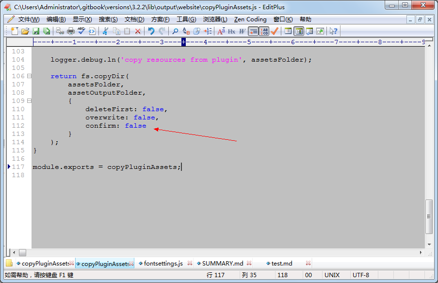
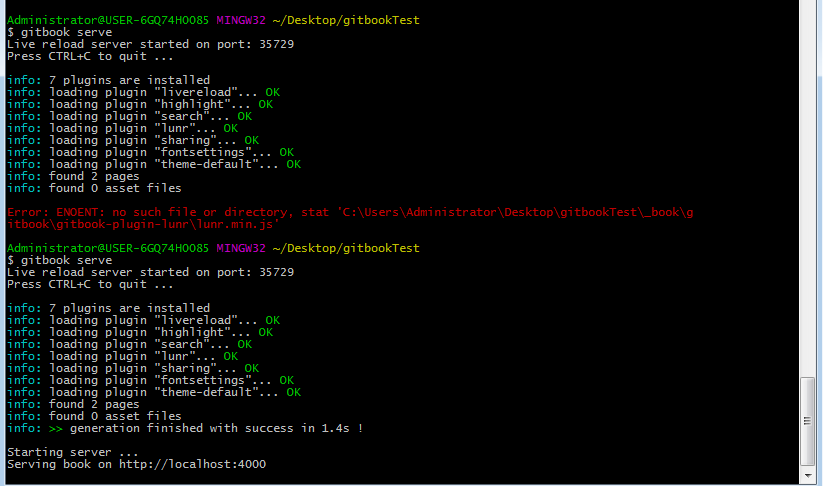

#Windows gitbook找不到fontsettings.js
### windows找不到 _book\gitbook\gitbook-plugin-fontsettings\buttons.js

找到copyPluginAssets.js对其进行修改

- 同样的问题链接
    - https://github.com/GitbookIO/gitbook/issues/1309

- 参考链接
    - https://github.com/GitbookIO/gitbook/blob/3.2.2/lib/output/website/copyPluginAssets.js#L112

##经过本人实践：

#### 之前一直报错如图

;

首先找到copyPluginAssets.js对其进行修改

;

打开找到的文件对其进行修改

;

把confirm:属性改为false (原本的是true)

####修改完成在执行gitbook serve

;

可以成功运行不在报错
